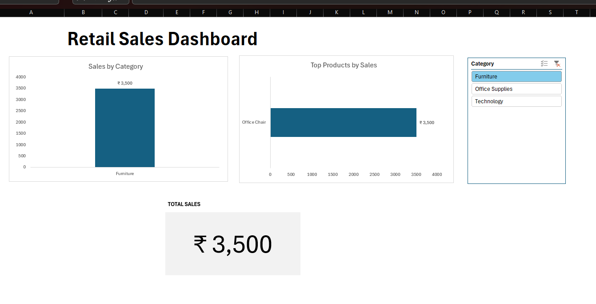

# Retail Sales Dashboard (Excel)

## Project Overview
Interactive retail sales dashboard built in Microsoft Excel to analyze sales performance using Pivot Tables, Slicers, and KPI Cards.

## Features
- Dynamic category filtering using slicers
- Sales by category visualization
- Top products performance analysis
- KPI card showing total sales
- Clean dashboard layout for business reporting

## Tools Used
- Microsoft Excel
- Pivot Tables
- Pivot Charts
- Slicers
- KPI Cards

## Files Included
- Retail_Sales_Dashboard.xlsx → Main interactive dashboard
- master_dataset.csv → Raw dataset
- Retail_Sales_Dashboard.pdf → Dashboard preview export

## How to Use
1. Download the Excel file
2. Open in Microsoft Excel (desktop recommended)
3. Use slicer to filter categories
4. Dashboard updates automatically
